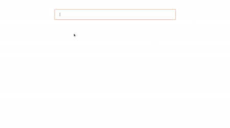

# AngularJS - Email Input Component with Validation

AngularJS based Email component, provides option to add single / multiple email input field with validation. The email value is automatically validated on blur event. You can change validation message using props. You can also disable email field using disable props.

## Table of contents

- [Browser Support](#browser-support)
- [Demo](#demo)
- [Getting started](#getting-started)
- [Usage](#usage)
- [Available Props](#available-props)
- [Methods](#methods)
- [Want to Contribute?](#want-to-contribute)
- [Collection of Components](#collection-of-components)
- [Changelog](#changelog)
- [License](#license)
- [Keywords](#Keywords)

## Browser Support

|  |  |  |  |  |
| ---------------------------------------------------------------------------------------- | ------------------------------------------------------------------------------------------- | ---------------------------------------------------------------------------------------- | ---------------------------------------------------------------------------------- | ---------------------------------------------------------------------------------------------------------------------------- |
| 83.0 ✔                                                                                   | 77.0 ✔                                                                                      | 13.1.1 ✔                                                                                 | 83.0 ✔                                                                             | 11.9 ✔                                                                                                                       |

## Demo

[](https://github.com/weblineindia/AngularJS-Email/email.gif)

## Getting started

Install the npm package:

```bash
npm install angular-weblineindia-email
#OR
yarn add angular-weblineindia-email
```

## Usage

Use the `<angular-weblineindia-email>` component:

Add in app.module.ts file

```typescript
import { NgModule } from "@angular/core";
import { EmailModule } from "angular-weblineindia-email";

@NgModule({
  imports: [EmailModule]
})
export class AppModule {}
```

Add in app.component.ts file

```typescript
import { faPlus, faMinus } from "@fortawesome/free-solid-svg-icons";

export class AppComponent {
  faPlus: any = faPlus;
  faMinus: any = faMinus;

  values: any = [{ email: "" }];

  emailValue: any = {
    placeholder: "Enter Email",
    maxlength: 50,
    emailFormateError: "Email is not valid",
    duplicateEmailError: "Do not enter same email",
    name: "email",
    id: "email",
    disabled: false,
    value: "",
    isMultiple: true,
    isShowPlus: true,
    tabindex: 0,
    index: 0
  };

  onFocus(event) {
    event.target.placeholder = "";
  }

  onBlur(event) {
    event.target.placeholder = this.emailValue.placeholder;
  }

  onChange(data) {
    this.values[data.index].email = data.event.target.value;
  }

  onAddMultipleEmail() {
    this.values.push({ email: "" });
  }
}
```

Add in app.component.html file

```html
<div *ngFor="let value of values;let indexOfelement=index;">
  <lib-email
    [placeholder]="emailValue.placeholder"
    [maxlength]="emailValue.maxlength"
    [emailFormateError]="emailValue.emailFormateError"
    [duplicateEmailError]="emailValue.duplicateEmailError"
    [name]="emailValue.name"
    [id]="emailValue.id"
    [disabled]="emailValue.disabled"
    [value]="value.email"
    [isMultiple]="emailValue.isMultiple"
    [isShowPlus]="values.length-1 === indexOfelement"
    [tabindex]="emailValue.tabindex"
    [index]="indexOfelement"
    [emailArray]="values"
    (focus)="onFocus($event)"
    (blur)="onBlur($event)"
    (change)="onChange($event)"
    (onPlus)="onAddMultipleEmail()"
  ></lib-email>
</div>
```

## Available Props

| Prop                | Type          | default                 | Description                                   |
| ------------------- | ------------- | ----------------------- | --------------------------------------------- |
| maxlength           | Number        | 50                      | maxlength for email                           |
| id                  | String        |                         | email id                                      |
| emailFormateError   | String        | Email is not valid      | email formate validation                      |
| duplicateEmailError | String        | Do not enter same email | duplicate email error                         |
| onMultipleEmail     | Function      |                         | when click on plus icon on email              |
| name                | String        | email                   | email name.                                   |
| index               | Number        | 0                       | email index.                                  |
| emailArray              | Array[Object] | [{email : ''}]          | email default array                           |
| isMultiple          | Boolean       | true                    | flag to implement multiple email              |
| isShowPlus          | Boolean       | false                   | flag to show plus icon for add multiple email |
| placeholder         | String        | Email                   | email placeholder                             |
| disabled            | Boolean       | false                   | disable input field                           |
| tabindex            | Number        | 0                       | email tabIndex                                |
| value            | String        |                     | email value                              |

## Methods

| Name        | Description                                         |
| ----------- | --------------------------------------------------- |
| focus       | Gets triggered when the input field receives focus. |
| blur        | Gets triggered when the input field loses focus.    |
| change | Gets triggered every time when input got changed.        |
| onPlus | Gets triggered every time when click on plus button.        |


## Want to Contribute?

- Created something awesome, made this code better, added some functionality, or whatever (this is the hardest part).
- [Fork it](http://help.github.com/forking/).
- Create new branch to contribute your changes.
- Commit all your changes to your branch.
- Submit a [pull request](http://help.github.com/pull-requests/).

---

## Collection of Components

We have built many other components and free resources for software development in various programming languages. Kindly click here to view our [Free Resources for Software Development](https://www.weblineindia.com/software-development-resources.html)

---

## Changelog

Detailed changes for each release are documented in [CHANGELOG.md](./CHANGELOG.md).

## License

[MIT](LICENSE)

[mit]: https://github.com/weblineindia/AngularJS-Email/blob/master/LICENSE

## Keywords

angular-weblineindia-email, email-validation-component, email-input, angularjs-email-input, multi-email-input
